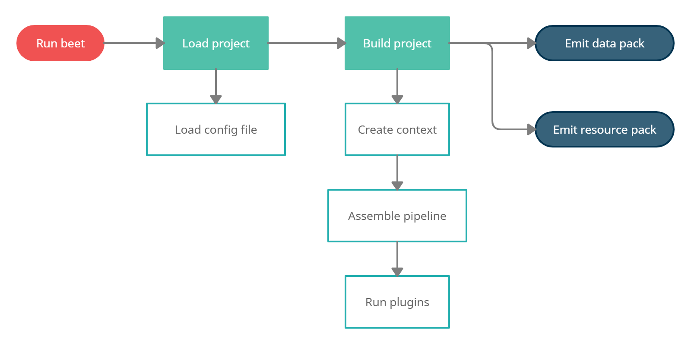

# Toolchain documentation

The `beet` toolchain makes it possible to process data packs and resource packs. It provides a unified developer experience for any tool that you might want to use to support your development workflow. The command-line utility allows you to link your project to minecraft and run the build process anytime you make a modification.

This page is still a work-in-progress.

---

## Build process overview

The build process is at the core of the `beet` toolchain. The toolchain first loads your project and config file, and then creates an empty context object holding a blank data pack and a blank resource pack. This context object is then sequentially handed over to each plugin in the `beet` [pipeline](#plugin-pipeline) configured by your project. The [pipeline](#plugin-pipeline) provides a composable execution model that allows you to combine plugins that cooperate to populate the output data pack and resource pack.



## Command-line utility

```
$ beet --help
Usage: beet [OPTIONS] COMMAND [ARGS]...

  The beet toolchain.

Options:
  -d, --directory DIRECTORY  Use the specified project directory.
  -c, --config FILE          Use the specified config file.
  -v, --version              Show the version and exit.
  -h, --help                 Show this message and exit.

Commands:
  build  Build the current project.
  cache  Inspect or clear the cache.
  link   Link the generated resource pack and data pack to Minecraft.
  watch  Watch the project directory and build on file changes.
```

TODO

## Configuration file

TODO

## Plugin pipeline

The entire [build process](#build-process-overview) revolves around the `beet` pipeline. The pipeline is responsible for loading and running the provided plugins. Plugins are simple functions that are called one after the other on the context object. The `beet` context holds all the data related to the build, such as the data pack, the resource pack, the template manager, or the cache handle.

```python
from beet import Context, Function

def greet(ctx: Context):
    """Plugin that adds a function for greeting the player."""
    ctx.data["greet:hello"] = Function(["say hello"])
```

Plugins can require other plugins at any point. Plugins required by other plugins are called plugin dependencies. Requiring a plugin makes sure that the plugin has been executed before going on. The pipeline makes sure that each distinguishable plugin only runs once, allowing multiple plugins to depend on a shared set of plugins. Requiring plugin dependencies effectively extends the pipeline dynamically, while it's running.

```python
from beet import FunctionTag

def greet_on_load(ctx: Context):
    """Plugin that calls the greeting function on load."""
    ctx.require(greet)
    ctx.data["minecraft:load"] = FunctionTag({"values": ["greet:hello"]})
```
