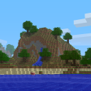

# Lectern snapshot

## Data pack

`@data_pack pack.mcmeta`

```json
{
  "pack": {
    "pack_format": 18,
    "description": ""
  },
  "overlays": {
    "entries": [
      {
        "formats": {
          "min_inclusive": 16,
          "max_inclusive": 17
        },
        "directory": "dummy_overlay"
      }
    ]
  }
}
```

`@data_pack pack.png`



### tutorial

`@function tutorial:greeting`

```mcfunction
say This is added before.
say Hello, world!
say This is added afterwards.
```

`@function tutorial:obtained_dead_bush`

```mcfunction
say You obtained a dead bush!
```

`@function tutorial:hidden`

```mcfunction
say This will not appear in the rendered markdown.
```

`@function tutorial:also_hidden`

```mcfunction
say This is also hidden.
```

`@function(strip_final_newline) tutorial:stripped`

```mcfunction
say This function doesn't have a final newline.
```

`@advancement tutorial:obtained_dead_bush`

```json
{
  "criteria": {
    "dead_bush": {
      "trigger": "minecraft:inventory_changed",
      "conditions": {
        "items": [
          {
            "item": "minecraft:dead_bush"
          }
        ]
      }
    }
  },
  "requirements": [
    [
      "dead_bush"
    ]
  ],
  "rewards": {
    "function": "tutorial:obtained_dead_bush"
  }
}
```

`@function_tag(strip_final_newline) tutorial:something_else`

```json
{
  "values": ["tutorial:stripped"]
}
```

`@function_tag tutorial:from_github`

```json
say foo
```

### minecraft

`@function_tag minecraft:load`

```json
{
  "values": [
    "tutorial:greeting",
    "#tutorial:something_else"
  ]
}
```

`@loot_table minecraft:blocks/diamond_ore`

```json
{
  "pools": [
    {
      "rolls": 1,
      "entries": [
        {
          "type": "minecraft:item",
          "name": "minecraft:dead_bush"
        }
      ]
    }
  ]
}
```

`@loot_table minecraft:blocks/yellow_shulker_box`

```json
{
  "type": "minecraft:block",
  "pools": [
    {
      "rolls": 1,
      "entries": [
        {
          "type": "minecraft:alternatives",
          "children": [
            {
              "type": "minecraft:dynamic",
              "name": "minecraft:contents",
              "conditions": [
                {
                  "condition": "minecraft:match_tool",
                  "predicate": {
                    "item": "minecraft:air",
                    "nbt": "{drop_contents:1b}"
                  }
                }
              ]
            },
            {
              "type": "minecraft:item",
              "name": "minecraft:yellow_shulker_box",
              "functions": [
                {
                  "function": "minecraft:copy_name",
                  "source": "block_entity"
                },
                {
                  "function": "minecraft:copy_nbt",
                  "source": "block_entity",
                  "ops": [
                    {
                      "source": "Lock",
                      "target": "BlockEntityTag.Lock",
                      "op": "replace"
                    },
                    {
                      "source": "LootTable",
                      "target": "BlockEntityTag.LootTable",
                      "op": "replace"
                    },
                    {
                      "source": "LootTableSeed",
                      "target": "BlockEntityTag.LootTableSeed",
                      "op": "replace"
                    }
                  ]
                },
                {
                  "function": "minecraft:set_contents",
                  "entries": [
                    {
                      "type": "minecraft:dynamic",
                      "name": "minecraft:contents"
                    }
                  ]
                }
              ]
            }
          ]
        }
      ]
    }
  ]
}
```

### text_in_block

`@function text_in_block:foo`

```mcfunction
say foo
```

## Overlay `dummy_overlay`

`@overlay dummy_overlay`

### tutorial

`@function tutorial:greeting`

```mcfunction
say Hello from overlay!
```

`@endoverlay`
